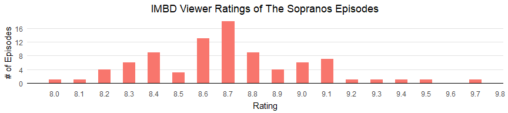

The Sopranos Episodes You Should Just Skip
================

I am rewatching The Sopranos, just in time for the 20 year anniversary. It's always been one of my top TV series ever, but a lot of time has passed. I was worried that it wouldn't hold up. But it's so good, right from the very first episode. It holds up. It might even be better, funnier, and smarter than I realized when I watched it for the first time.

Then I got to the episode "A Hit is a Hit". It's just bad. Meandering plot structure, poor editing, and bad dialogue. I didn't even want to finish it.

It recieved an 8.3 on IMDb viewer ratings. I was shocked. **8.3 is not a score for a bad hour of television**. 8.3 should be, objectively, pretty good. 8.3 is something you would recommend and is worth your time. "A Hit is a Hit" is neither of those things. And, objectively, the ratings of the other episodes I watched so far weren't all that different, from 8.6 to 8.9:   

    ## # A tibble: 10 x 3
    ##    Episode `Episode Name`                     Rating
    ##      <dbl> <chr>                               <dbl>
    ##  1     101 The Sopranos                          8.6
    ##  2     102 46 Long                               8.6
    ##  3     103 Denial, Anger, Acceptance             8.8
    ##  4     104 Meadowlands                           8.8
    ##  5     105 College                               8.9
    ##  6     106 Pax Soprana                           8.7
    ##  7     107 Down Neck                             8.6
    ##  8     108 The Legend of Tennessee Moltisanti    8.8
    ##  9     109 Boca                                  8.7
    ## 10     110 A Hit Is a Hit                        8.3

  A difference of .6 shouldn't be the gap between a bad episode and a really good episode. This is where some statistical analysis can be useful. Here is the the distribution of IMDB viewer rating scores of all the episodes:  

This distribution is roughly [normal](https://en.wikipedia.org/wiki/Normal_distribution) enough for my purpose, which is to make sure I never waste my time watching an episode as bad as "A Hit is a Hit" again. That particular episode was 1.25 standard deviations (SD) lower than the mean rating of all episodes, so I decided to use 1 SD lower than the mean as my cutoff for "bad" episodes. In a perfectly normal dstribution, this means I wouldn't watch 17% of all the episodes. I should remind you that The Sopranos is 86 hours of television. I can live with watching 17% less of it.

IMDb ratings visualizations
---------------------------

How do I visualize IMDb ratings? I found some nice plots from [u/Pyrolamas](https://www.reddit.com/r/dataisbeautiful/comments/6rzoqw/the_hillenburg_effect_spongebob_squarepants_imdb/) and [u/shivasprogeny](https://www.reddit.com/r/dataisbeautiful/comments/1g7jw2/seinfeld_imdb_episode_ratings_oc/) on reddit that seemed like a good models for me to emulate.

Here's the result.

Of course, I wanted to apply my criteria for "bad episodes," then highlight and label them. Here is the final product:    

